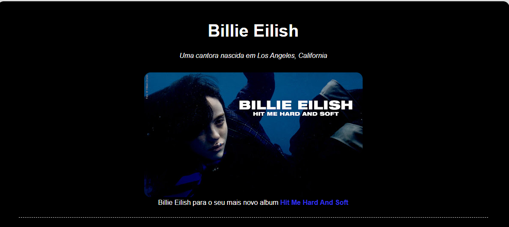

<h1 align="center"> Tributo Billie Eilish </h1>

Projeto desenvolvido durante o curso Formação Front-End do Instrutor Matheus Battisti,na Plataforma Udemy .

 

 ## 🚀 Tecnologias Usadas:  
 - HTML
 - CSS
 - FIGMA

## 💻 Sobre o Projeto:

  Este é um projeto web que apresenta a biografia de **[Billie Eilish]**, destacando os principais momentos da sua vida e carreira artística.
  O objetivo deste projeto é contar a trajetória musical da cantora, desde o início de sua carreira até os dias atuais.
  
## 📱 Responsividade:
  O projeto é totalmente responsivo, garantindo uma boa visualização tanto em dispositivos móveis quanto em desktops.

## ✨ Autor:

Desenvolvido por [Guilherme Almeida].  

Entre em contato: 
**Email:**  guialmeida.dev@gmail.com

**Whatsapp:** +55 85 99299-5691
